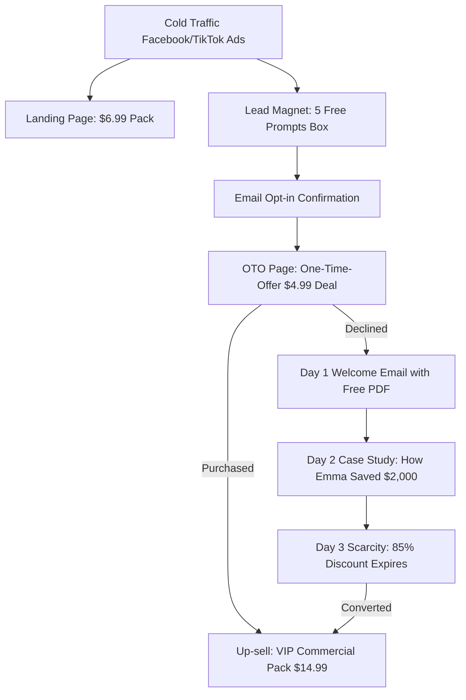

# E-Commerce AI Prompts Sales Funnel Strategy

This document outlines the complete **Autoresponder Email Marketing Sequence (Tripwire Funnel)** to turn free subscribers from the lead capture form into paying customers.

---

## 📈 The Funnel Architecture

---

## 📧 Email Autoresponder Drip Campaign

Set up this 3-day automation sequence in your email marketing software (e.g., Mailchimp, Klaviyo, Brevo).

### ✉️ Day 1: Welcome & Lead Delivery (Send Immediately)
*   **Subject:** 🎁 Your 5 Free Studio-Quality AI Prompts Inside!
*   **Goal:** Deliver the free asset, build trust, and re-introduce the main package.
*   **Body Copy:**
    > Hey [First Name],
    >
    > Here is your download link for the **5 Free Product Photography Prompts**:
    > 🔗 **[Download Free Samples PDF]**
    >
    > Simply copy-paste these templates into your AI image generator to render instant glass, water splash, and limestone mockups.
    >
    > **Want all 300+ prompt templates?**
    > For the next 24 hours, you can unlock the full commercial catalog containing lighting setups, apparel hangers, and cosmetic backdrops for only **$6.99** (regularly $49.00).
    >
    > 🔗 **[Unlock 300+ Prompts Now (85% OFF)]**
    >
    > To your success,
    > The PROMPTGOAT Team

---

### ✉️ Day 2: Case Study & Social Proof (Send 24 Hours Later)
*   **Subject:** How Emma generated all her Shopify assets for $6.99 (Case Study)
*   **Goal:** Address objections, show real-world applications, and provide social proof.
*   **Body Copy:**
    > Hey [First Name],
    >
    > Meet Emma. She runs a boutique skincare brand on Shopify.
    >
    > Last month, she was quoted **$1,500** for a studio photoshoot of her new facial serums. She decided to try our prompt catalog instead.
    >
    > Using our **Minimalist Stone Serum** template, she rendered 12 high-resolution, light-refracting product cards in under 10 minutes.
    >
    > **The results?**
    > *   Cost: **$6.99** (Our pack) + $10 (AI subscription).
    > *   Time: **10 minutes** instead of 2 weeks.
    > *   **18% increase in store conversion rates** due to premium visual styling.
    >
    > Don't spend thousands on photography. Get the exact templates Emma used today:
    >
    > 🔗 **[Get the 300+ Prompts + 4 Bonuses]**
    >
    > Best,
    > The PROMPTGOAT Team

---

### ✉️ Day 3: High Scarcity & Discount Closing (Send 48 Hours Later)
*   **Subject:** Last Chance: Your 85% discount expires tonight ⏰
*   **Goal:** Leverage urgency and fear-of-missing-out (FOMO) to close the sale.
*   **Body Copy:**
    > Hey [First Name],
    >
    > This is a quick heads-up that your special launch discount for the **300+ Product Prompts Pack** is expiring in a few hours.
    >
    > Tomorrow, the price returns to the regular retail value of **$49.00**.
    >
    > For less than the price of a cup of coffee, you get:
    > *   300+ Copy-Paste Commercial Prompts
    > *   CTR Ad Angles Blueprint Bonus
    > *   Visual Backdrop Reference Database
    > *   Full Commercial Resell Rights
    >
    > Secure your lifetime access at **$6.99** before the link expires.
    >
    > 🔗 **[Claim 85% Discount & All Bonuses Now]**
    >
    > See you inside,
    > The PROMPTGOAT Team
